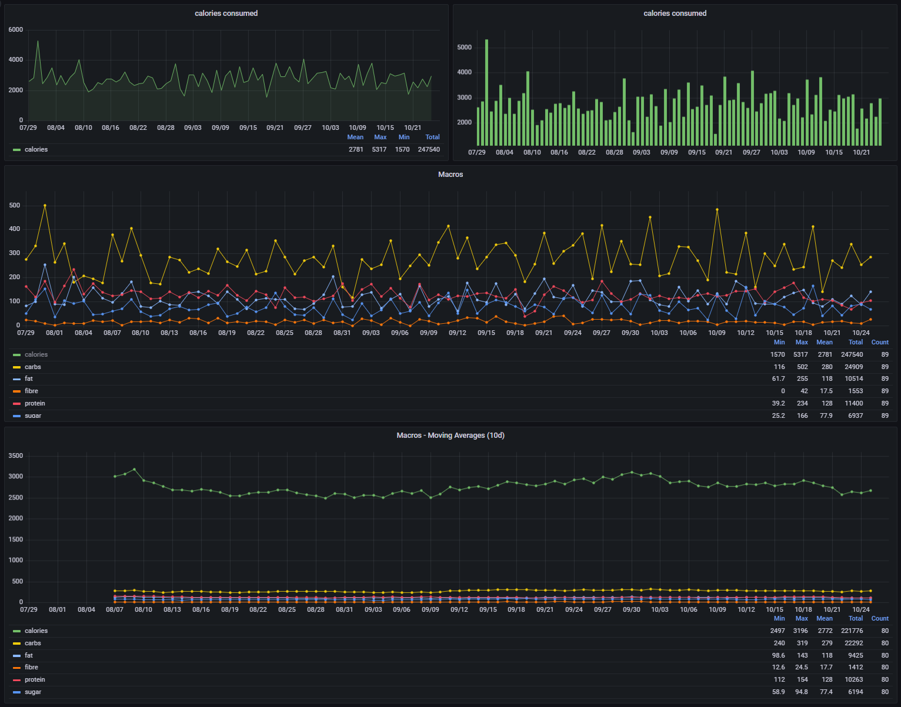

# Grafana Dashboard

## Screenshots

After gathering all the data, it's easy to display graphs based on it in Grafana. As Grafana cannot use MongoDB as a
data source, it's necessary to use InfluxDB for this. You may use
my [Grafana-Dashboard](../resources/grafana-dashboard.json)
or build your own dashboard.

