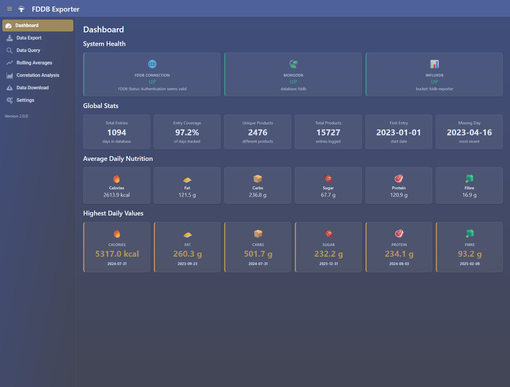
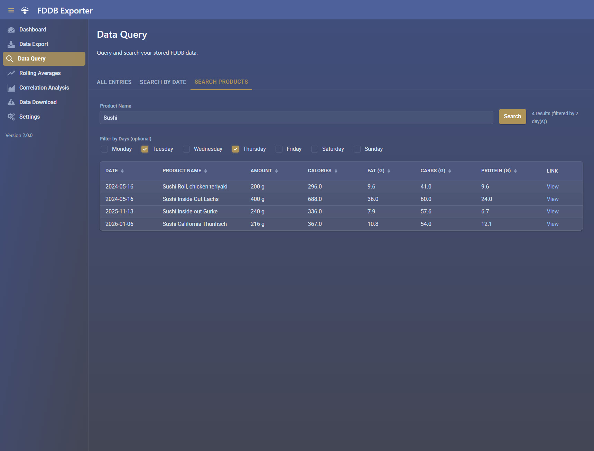
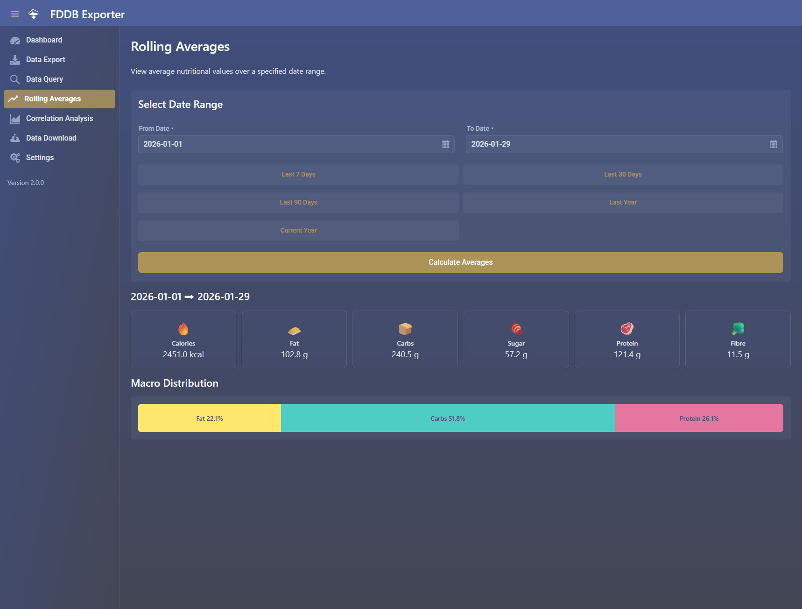
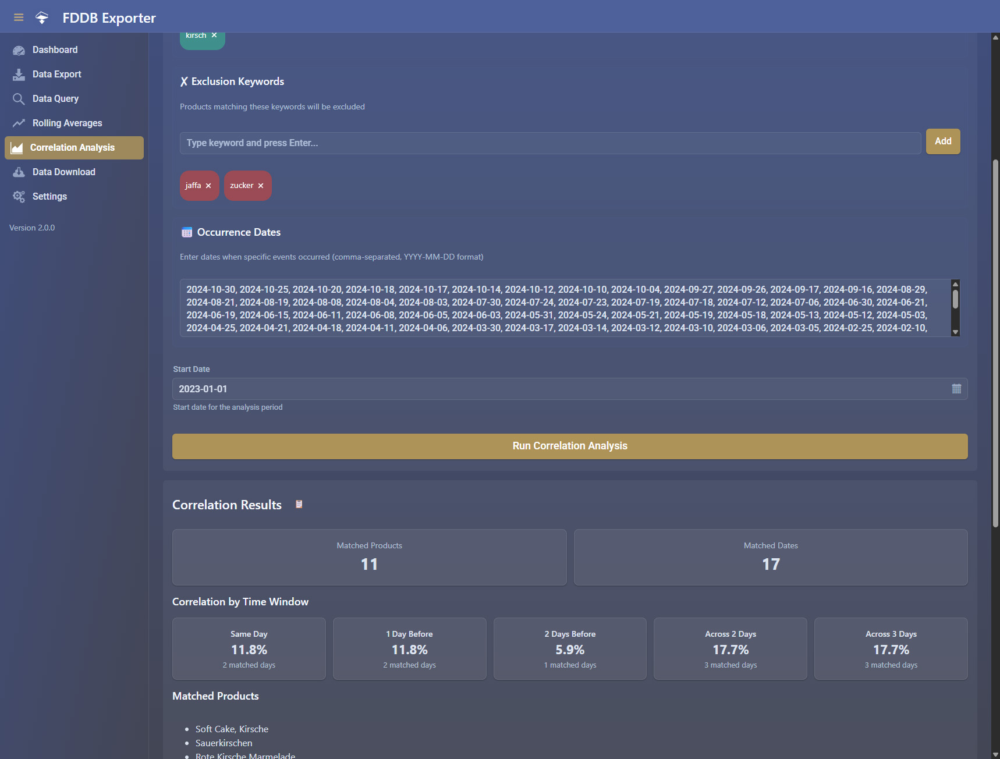
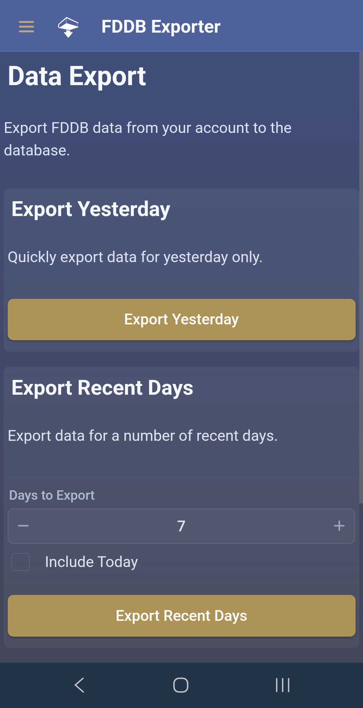
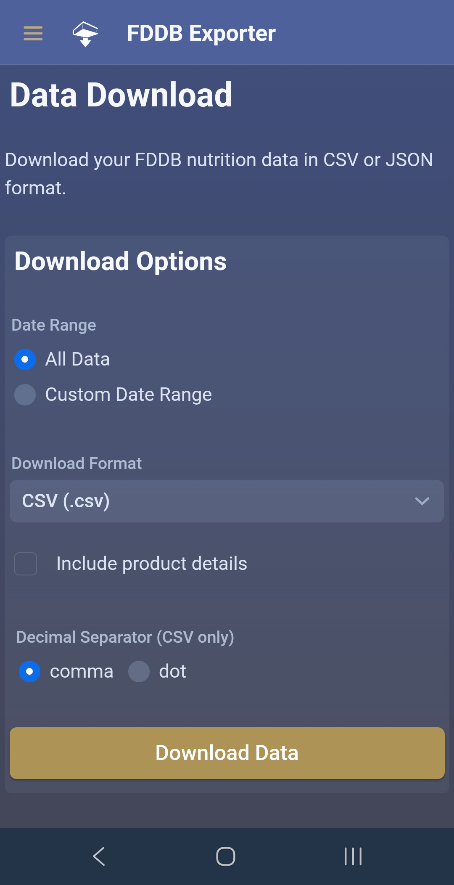

# Web UI

The FDDB Exporter includes a built-in web interface powered
by [Vaadin](https://vaadin.com/) / [Hilla](https://hilla.dev/), providing a modern and intuitive way to interact with
all features of the application directly from your browser.

## Overview

The web UI offers a complete graphical interface for all FDDB Exporter features. All functionality available through the
REST API can also be accessed through this user-friendly interface, making it easier to manage your nutritional data
without needing to make API calls directly.

## Features

The web interface provides access to all core features:

- **Dashboard**: View your nutritional statistics at a glance
- **Export Data**: Manually trigger data exports for specific date ranges or recent days
- **Daily Search**: Look up nutritional data for any specific date
- **Product Search**: Find products by name with optional day-of-week filtering
- **Statistics**: View comprehensive statistics including averages, highest values, and entry coverage
- **Rolling Averages**: Calculate averages for custom date ranges
- **Correlation Analysis**: Analyze correlations between products and specific dates to identify potential food
  sensitivities
- **Download Data**: Export your data in CSV or JSON format with customizable options

## Screenshots

The following screenshots showcase several pages of the FDDB Exporter web interface for demonstration purposes. Both
desktop and mobile versions provide the same features and functionality - the differences shown below are purely visual
adaptations for optimal display on different screen sizes.

### Desktop Views

<table>
  <tr>
    <th align="center">Dashboard</th>
    <th align="center">Product Search</th>
  </tr>
  <tr>
    <td align="center">
      <a href="../images/desktop-dashboard.jpg" target="_blank">
        
      </a>
    </td>
    <td align="center">
      <a href="../images/desktop-product-search.jpg" target="_blank">
        
      </a>
    </td>
  </tr>
  <tr>
    <th align="center">Rolling Averages</th>
    <th align="center">Correlation Analysis</th>
  </tr>
  <tr>
    <td align="center">
      <a href="../images/desktop-rolling-averages.jpg" target="_blank">
        
      </a>
    </td>
    <td align="center">
      <a href="../images/desktop-correlation.jpg" target="_blank">
        
      </a>
    </td>
  </tr>
</table>

### Mobile Views

<table>
  <tr>
    <th align="center">Data Export</th>
    <th align="center">Download</th>
  </tr>
  <tr>
    <td align="center">
      <a href="../images/mobile-export.jpg" target="_blank">
        
      </a>
    </td>
    <td align="center">
      <a href="../images/mobile-download.jpg" target="_blank">
        
      </a>
    </td>
  </tr>
</table>

## Feature Details

### Rolling Averages

The **Rolling Averages** view allows you to calculate average nutritional values over any custom date range. This is
useful
for analyzing your nutritional patterns over specific periods.

#### Quick-Select Buttons

The view includes several preset buttons for common time periods:

- **Last 7 Days** — Averages for the past week
- **Last 30 Days** — Averages for the past month
- **Last 90 Days** — Averages for the past quarter
- **Last Year** — Averages for the past 365 days
- **Current Year** — Averages from January 1 to yesterday of the current year

#### Custom Presets

You can also create **custom date range presets** that will appear as additional quick-select buttons:

1. Navigate to **Settings** in the menu
2. Scroll to the **"Rolling Average Presets"** section
3. Enter a name for your preset (e.g., "Q1 2025", "Summer 2024")
4. Select the **From Date** and **To Date** for your custom range
5. Click **"Add Preset"**

Once saved, your custom preset will appear as a button on the Rolling Averages view, allowing you to quickly calculate
averages for that date range with a single click.
To create a custom preset which tracks to the current date, simply set the **To Date** to a future date (e.g., December
31, 2030). This way, the preset will always calculate averages up to yesterday's date, making it ideal for tracking
ongoing periods like the current quarter or year.

**Example use cases for custom presets:**

- Compare quarterly performance (Q1, Q2, Q3, Q4)
- Analyze seasonal patterns (e.g., "Summer 2024", "Winter 2023")
- Track specific project or diet phases (e.g., "Keto Phase 1", "Training Period")

#### Results

After selecting a date range and clicking **Calculate Averages**, the view displays:

- **Individual nutrient cards** — Average values for calories, fat, carbs, sugar, protein, and fiber
- **Macro distribution bar** — Visual representation showing the percentage breakdown of macronutrients (fat, carbs,
  protein) in your average daily intake

## Mobile Support

The web UI is fully responsive and works seamlessly on mobile devices. You can access all features from your smartphone
or tablet with the same functionality as on desktop.

### Progressive Web App (PWA)

The FDDB Exporter web UI can be installed as a Progressive Web App (PWA) on your device for easier access. This may only
work if you are accessing the web UI over HTTPS.

**On Mobile (iOS/Android):**

1. Open the FDDB Exporter URL in your mobile browser
2. Tap the browser menu (share icon on iOS, three dots on Android)
3. Select "Add to Home Screen" or "Install App"
4. The app will be added to your home screen for quick access

**On Desktop (Chrome/Edge):**

1. Open the FDDB Exporter URL in your browser
2. Look for the install icon in the address bar (or use the browser menu)
3. Click "Install" to add it as a standalone application

Once installed as a PWA, you can launch the FDDB Exporter like any other app on your device, with faster loading times
and an app-like experience.

## Accessing the UI

The web interface is available at the root URL of your FDDB Exporter instance:

```
http://localhost:8080/
```

Simply navigate to this URL in your browser after starting the application.

## Version Updates

The web UI includes an automatic version check feature. When a new version of FDDB Exporter is available, a notification
will appear in the sidebar menu and in the logs.

This helps you stay up to date with the latest features and improvements.
